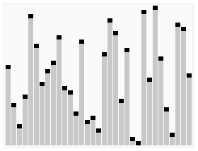

# Quick-select

> Quick-sort’s brother (kinda, but doesn’t sort stuff, more below…)
> 

### ’ The basic essence is that it’s an algorithm used to find the **k-th smallest element** in an unsorted list without fully sorting it. Instead of arranging everything like Quick Sort does, Quick Select just focuses on the part of the array that act**ually matters ’**

INTUITION:

In many practical applications, we are not interested in fully sorting a dataset. Instead, we often need only a specific order statistic - such as the k-th smallest element.

Examples include finding the median, percentile values, or threshold cutoffs in large datasets. In such cases, performing a complete sort is unnecessary and computationally inefficient.

The naive approach to finding the k-th smallest element is to first sort the entire array and then return the element at index k. While straightforward, this method has a time complexity of **O(n log n)** due to the sorting process. This becomes inefficient when dealing with large datasets, especially when only one element is required.


- A look at the naive one

Quick Select provides a more efficient alternative. It is a selection algorithm based on the partitioning principle of Quick Sort. Instead of sorting the entire array, it partitions the data around a chosen pivot and recursively processes only the portion that may contain the k-th smallest element. By discarding half of the data at each step (on average),

**Quick Select achieves an average time complexity of O(n).**

Thus, Quick Select is preferred when:

- Only the k-th smallest (or largest) element is needed.
- The dataset is large.
- Performance optimization is important.

In summary, Quick Select improves efficiency by avoiding unnecessary sorting and focusing only on the relevant portion of the data, making it asymptotically faster than the naive sorting-based approach for this problem.

***Before starting Quick-Select, we have a contendor for this same problem….***

### *Median-of-Medians Algorithm*

The **Median-of-Medians** algorithm is a deterministic selection algorithm used to find the k-th smallest element in an unsorted array in **worst-case linear time O(n)**.

It improves upon basic Quick Select by choosing a *good pivot* in a systematic way rather than randomly.

**Working idea (briefly):**

1. Divide the array into groups of 5 elements.
2. Find the median of each group.
3. Recursively find the median of those medians — this becomes the pivot.
4. Partition the array around this pivot.
5. Recur only on the side that contains the k-th element.

By carefully choosing the pivot, the algorithm guarantees that a fixed fraction of elements are discarded in every step, ensuring worst-case O(n) time complexity.

---

**Shortcomings:**

- **High constant factors:** Although it is O(n) in the worst case, the number of operations per step is relatively large.
- **More complex implementation:** Compared to Quick Select, it is harder to implement and understand.
- **Slower in practice:** For most practical datasets, randomized Quick Select performs faster despite its O(n²) worst case, because that worst case is rare.

In summary, Median-of-Medians guarantees strong theoretical performance but is often less efficient in real-world applications due to overhead

---

---

# **Quickselect Algorithm**

Ex:

`Input: arr[] = {7, 10, 4, 3, 20, 15}
k = 3
Output: 7`

`Input: arr[] = {7, 10, 4, 3, 20, 15}
k = 4
Output: 10`

### THE BIG-IDEA

It is based on the same partitioning idea used in Quick Sort, but instead of recursively sorting both halves, it only continues with the part that contains the desired element.

### Basic Working Steps:

1. **Choose a Pivot**
    
    Select any element from the array (commonly the last or a random element).
    
2. **Partition the Array**
    
    Rearrange the elements so that:
    
    - All elements smaller than the pivot are placed on the left.
    - All elements greater than the pivot are placed on the right.
    - The pivot is placed in its correct sorted position.
3. **Check the Pivot Position**
    - If the pivot’s position equals k, then it is the k-th smallest element.
    - If k is smaller than the pivot’s position, apply Quick Select to the left subarray.
    - If k is larger, apply Quick Select to the right subarray.
4. **Repeat**
    
    Continue the process only on the relevant subarray until the k-th element is found.
    
    
    
    Source: Wikipedia
    

Psuedo-code for the idea of how it works:

```
function quickSelect(list, left, right, k)

   if left = right
      return list[left]

   Select a pivotIndex between left and right

   pivotIndex := partition(list, left, right,
                                  pivotIndex)
   if k = pivotIndex
      return list[k]
   else if k < pivotIndex
      right := pivotIndex - 1
   else
      left := pivotIndex + 1
```

Actual C++ code:

```cpp
#include <bits/stdc++.h>
using namespace std;
// Standard partition process of QuickSort.
// It considers the last element as pivot
// and moves all smaller elements to the left of
// it and greater elements to the right.
int partition(vector<int>& arr, int l, int r) {
    int x = arr[r], i = l;
    for (int j = l; j <= r - 1; j++) {
        if (arr[j] <= x) {
            swap(arr[i], arr[j]);
            i++;
        }
    }
    swap(arr[i], arr[r]);
    return i;
}
// This function returns the k-th smallest 
// element in arr[l..r] using QuickSort-based method.
// ASSUMPTION: ALL ELEMENTS IN ARR[] ARE DISTINCT.
int kthSmallest(vector<int>& arr, int l, int r, int k) {
    // If k is smaller than the number of elements
    // in the array.
    if (k > 0 && k <= r - l + 1) {
        // Partition the array around the last 
        // element and get the position of the pivot 
        // element in the sorted array.
        int index = partition(arr, l, r);
        // If position is the same as k.
        if (index - l == k - 1)
            return arr[index];
        // If position is more, recur for the left subarray.
        if (index - l > k - 1) 
            return kthSmallest(arr, l, index - 1, k);
        // Else recur for the right subarray.
        return kthSmallest(arr, index + 1, r, 
                            k - index + l - 1);
    }
    // If k is more than the number of elements in the array.
    return INT_MAX;
}
// Driver program to test the above methods.
int main() {
    vector<int> arr = {10, 4, 5, 8, 6, 11, 26};
    int n = arr.size();
    int k = 3;
    cout << "K-th smallest element is " 
         << kthSmallest(arr, 0, n - 1, k);
    return 0;
}
//Source: GFG
```

### Proof of Correctness

After partitioning, the pivot is placed in its correct sorted position.

If the pivot is at index **p**, then it is the (p+1)-th smallest element.

- If **k = p**, we return the pivot — correct answer.
- If **k < p**, the k-th smallest must lie in the left subarray.
- If **k > p**, it must lie in the right subarray.

Each step reduces the problem size while preserving the search for the correct element.

As the subarray shrinks and the pivot remains correctly positioned, Quick Select will eventually return the correct k-th smallest element.

### Time Complexity

- **Average case:** `O(n)`
- **Worst case:** `O(n²)`

### Space Complexity

- **Average case:** `O(log n)`
- **Worst case:** `O(n)`

### Empirical Runtime Observations for Quickselect

| Number of Elements (n) | k Selected | Execution Time (seconds) | Observed Growth |
| --- | --- | --- | --- |
| 10⁵ | n/2 | 0.01 | — |
| 10⁶ | n/2 | 0.09 | ~9× increase |
| 10⁷ | n/2 | 0.95 | ~10× increase |
| 10⁸ (estimated) | n/2 | 9.5 | ~10× increase |
| 10⁹ (extrapolated) | n/2 | 95 | ~10× increase |

*~~Dry run it on a sample data (~1e9 datapoints)~~* 

## Real-World Applications of Quickselect

Common use cases include:

- **Finding the median in large datasets** (statistics, data analytics)
- **Percentile computation** (e.g., 95th percentile latency in servers)
- **Top-k problems** (e.g., kth highest score)
- Used internally in:
    - NumPy (`np.partition`)
    - C++ Standard Library (`std::nth_element`)
    - Google's large-scale data pipelines
    - Apache Spark analytics jobs

### **End of Quick-Selection, Thanks!!**

