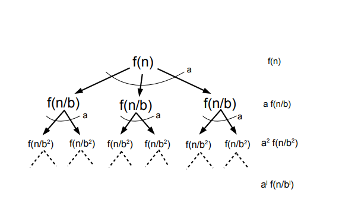

<h2>Motivation: Divide and Conquer and Recurrence Relations</h2>

Many efficient algorithms are based on the divide-and-conquer technique.
In this approach, a problem is broken into smaller subproblems of the same type, each
subproblem is solved recursively, and the results are combined to form the final solution.
This works well when the problem has optimal substructure, meaning the solution
to the problem depends on solutions to its subproblems.

Since divide-and-conquer algorithms are naturally recursive, their running time also
becomes recursive. Unlike simple iterative algorithms, the total time now depends on the
time taken by recursive calls on smaller inputs.

As a result, the running time of such algorithms is expressed using
<strong>recurrence relations</strong>, typically of the form
<em>T(n) = aT(n/b) + f(n)</em>. To analyze these recurrences efficiently, we need systematic
methods, which motivates the study of the Master Theorem.

<h2>The Master Theorem</h2>

Many divide-and-conquer algorithms lead to recurrence relations of a common form.
The <strong>Master Theorem</strong> provides a convenient way to find the asymptotic
running time of such recurrences without solving them from scratch each time.

The theorem applies to recurrences of the form:

<em>T(n) = aT(n/b) + f(n)</em>

Here, <em>a</em> represents the number of subproblems, each of size <em>n/b</em>, and
<em>f(n)</em> denotes the cost of dividing the problem and combining the results.
We assume that <em>a ≥ 1</em>, <em>b &gt; 1</em>, and <em>T(1) = Θ(1)</em>.

The Master Theorem compares the function <em>f(n)</em> with
<em>nlogba</em> and classifies the recurrence into one of the
following three cases:

<strong>Case 1:</strong>
If <em>f(n) = O(nlogba − ε)</em> for some constant <em>ε &gt; 0</em>,
then the work done by the recursive calls dominates, and
<em>T(n) = Θ(nlogba)</em>.

<strong>Case 2:</strong>
If <em>f(n) = Θ(nlogba)</em>, then the work is evenly distributed
across all levels of recursion, and
<em>T(n) = Θ(nlogba log n)</em>.

<strong>Case 3:</strong>
If <em>f(n) = Ω(nlogba + ε)</em> for some constant <em>ε &gt; 0</em>,
and the regularity condition holds, then the non-recursive work dominates, and
<em>T(n) = Θ(f(n))</em>.

<h2>Proof of the Master Theorem (Recursion Tree Method)</h2>

From the above recursion tree, we observe the structure of the divide-and-conquer process.
At the root level, there is a single problem of size <strong>n</strong>. Each problem is
divided into <strong>a</strong> subproblems, each of size <strong>n/b</strong>.

After every k levels of recursion, there are
ak subproblems, each of size
n / bk.

After <strong>k</strong> levels of recursion, there are
<strong>ak</strong> subproblems, each of size
<strong>n / bk</strong>.

So, the total work done at the <strong>k</strong>-th level is

O((n / bk)d) · ak
= O(ak (n / bk)d)

= O(nd (a / bd)k)

After <strong>logb n</strong> levels, the subproblem size
reduces to 1, which corresponds to the base case of the recursion.

Therefore, the total running time of the algorithm is obtained by
summing the work done at each level:

T(n) = O(
nd
∑k = 0logb n
(a / bd)k
)

We have obtained the following expression for the running time:

T(n) = O(
nd
∑k = 0logb n
(a / bd)k
)

<strong>Case 1:</strong> <strong>a &lt; bd</strong>

In this case, we have
<strong>a / bd &lt; 1</strong>.
So by the summation lemma we know that this series converges to a constant.

Therefore, the total running time is dominated by the factor
<strong>nd</strong>, and we get

<strong>T(n) = O(nd)</strong>.

<strong>Case 2:</strong> <strong>a = bd</strong>

In this case, we have
a / bd = 1.
Now as each term turns out to be 1 so sum turns out be (logb n).

Therefore, the total running time becomes

<strong>T(n) = O(nd logb n)</strong>.

<strong>Case 3:</strong> <strong>a &gt; bd</strong>

In this case, we have
<strong>a / bd &gt; 1</strong>.
Therefore, the summation grows exponentially and is dominated by its last term,
which is
<strong>(a / bd)logb n</strong>.

Substituting this into the expression for <strong>T(n)</strong>, we get

T(n) = O(
nd
(a / bd)logb n
)

Using the identity
<strong>(a / bd)logb n
= nlogb a − d</strong>,
we obtain

<strong>T(n) = O(nlogb a)</strong>.

<strong>Theorem (Master Theorem):</strong>
If
<strong>T(n) = aT(n / b) + O(nd)</strong>
for constants
<strong>a &gt; 0</strong>,
<strong>b &gt; 1</strong>, and
<strong>d ≥ 0</strong>,
then the running time satisfies the following bounds:

<strong>
T(n) ∈
{
O(nd) &nbsp;&nbsp;&nbsp;&nbsp;&nbsp;&nbsp;&nbsp;&nbsp; if a &lt; bd  
O(nd log n) &nbsp; if a = bd  
O(nlogb a) if a &gt; bd
}
</strong>

The three cases are commonly referred to as the
<strong>top-heavy</strong>,
<strong>steady-state</strong>, and
<strong>bottom-heavy</strong>
cases respectively, depending on which level of the recursion tree dominates the total
cost.

Thus, the proof follows by expressing the total running time as a summation over the
levels of the recursion tree and analyzing this summation for different values of
a relative to bd. This leads directly to the three cases of the Master Theorem.

